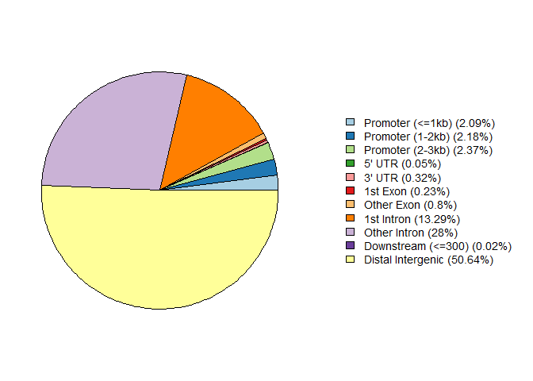
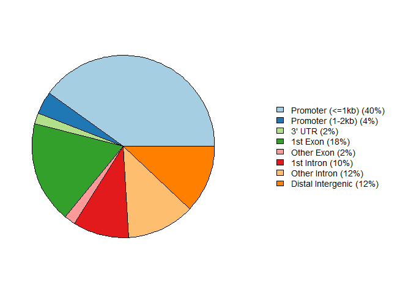

CoTEs visualization
================
Yahan Zhang
2023-11-21

## Import the necessary libraries

``` r
library(ChIPseeker)
library(TxDb.Hsapiens.UCSC.hg38.knownGene)
library(org.Hs.eg.db)
```

## Read in the files

``` r
txdb<-TxDb.Hsapiens.UCSC.hg38.knownGene
peak_core <- readPeakFile('D:/TEs_CoTEs_pipline/data/V2-TEs/non_olap/cores1000/542_L1MA1_Merged.bed')
peak_TE <- readPeakFile('D:/TEs_CoTEs_pipline/data/V2-TEs/non_olap/TEs/542_L1MA1_Merged.bed')
#plotAnnoPie(peakAnno)
#peakAnno = as.data.frame(peakAnno)
```

## Anotate the genomic regions

``` r
peakAnno_TE<-annotatePeak(peak_TE,tssRegion=c(-3000,3000),TxDb=txdb,annoDb="org.Hs.eg.db")
```

    ## >> preparing features information...      2023-11-23 2:49:39 PM 
    ## >> identifying nearest features...        2023-11-23 2:49:41 PM 
    ## >> calculating distance from peak to TSS...   2023-11-23 2:49:44 PM 
    ## >> assigning genomic annotation...        2023-11-23 2:49:44 PM 
    ## >> adding gene annotation...          2023-11-23 2:50:34 PM 
    ## >> assigning chromosome lengths           2023-11-23 2:50:35 PM 
    ## >> done...                    2023-11-23 2:50:35 PM

``` r
peakAnno_core<-annotatePeak(peak_core,tssRegion=c(-3000,3000),TxDb=txdb,annoDb="org.Hs.eg.db")
```

    ## >> preparing features information...      2023-11-23 2:50:35 PM 
    ## >> identifying nearest features...        2023-11-23 2:50:35 PM 
    ## >> calculating distance from peak to TSS...   2023-11-23 2:50:35 PM 
    ## >> assigning genomic annotation...        2023-11-23 2:50:35 PM 
    ## >> adding gene annotation...          2023-11-23 2:50:41 PM 
    ## >> assigning chromosome lengths           2023-11-23 2:50:41 PM 
    ## >> done...                    2023-11-23 2:50:41 PM

## Plot the proportions of genomic regions

``` r
plotAnnoPie(peakAnno_TE)
```

<!-- -->

``` r
plotAnnoPie(peakAnno_core)
```

<!-- -->

``` r
peakAnno = as.data.frame(peakAnno_core)
peakAnno
```

    ##               seqnames     start       end   width strand
    ## 1                 chr3 162617689 163586686  968998      *
    ## 2                 chrX  66132624  66846941  714318      *
    ## 3                 chrX  66846981  67382602  535622      *
    ## 4                 chrX  78234440  79179059  944620      *
    ## 5                 chrX  84299068  84656709  357642      *
    ## 6                 chrX  86101265  86780526  679262      *
    ## 7                 chrX  92416130  93562722 1146593      *
    ## 8                 chrX  94305762  95246445  940684      *
    ## 9                 chrX  95310191  96209102  898912      *
    ## 10                chrX 112938020 114131076 1193057      *
    ## 11                chrX 120505949 121496670  990722      *
    ## 12                chrX 121550945 122531150  980206      *
    ## 13                chrX 126492302 127136271  643970      *
    ## 14                chrX 141053490 142411052 1357563      *
    ## 15                chrX 142839916 143969656 1129741      *
    ## 16                chrX 143970242 144903835  933594      *
    ## 17                chrX 101392657 101918323  525667      *
    ## 18                chr4  43113058  43804898  691841      *
    ## 19                chrX  33642172  33940271  298100      *
    ## 20               chr21  22868644  23233124  364481      *
    ## 21                chrX  99251366  99779440  528075      *
    ## 22                chrX  87262284  87886862  624579      *
    ## 23                chrX 106073913 106306851  232939      *
    ## 24                chrX  98321649  98539954  218306      *
    ## 25                chr1 187114160 187258884  144725      *
    ## 26                chr1 211447197 211464618   17422      *
    ## 27                chrX 140234740 140403394  168655      *
    ## 28               chr13  80670502  80680494    9993      *
    ## 29                chr2  80709109  80735002   25894      *
    ## 30                chr5  43460381  43473237   12857      *
    ## 31                chr5 100279730 100292011   12282      *
    ## 32                chr5 159676162 159693179   17018      *
    ## 33 chr6_GL000253v2_alt   1587720   1596898    9179      *
    ## 34                chr1 196758085 196849258   91174      *
    ## 35               chr10  92056318  92061948    5631      *
    ## 36               chr14  50681907  50696101   14195      *
    ## 37               chr15  33267073  33276602    9530      *
    ## 38               chr17  58256426  58263967    7542      *
    ## 39               chr19  45409819  45413274    3456      *
    ## 40                chr4 111131216 111138819    7604      *
    ## 41                chr5  89652284  89684827   32544      *
    ## 42                chr5 144629900 144663592   33693      *
    ## 43                chr6  30277496  30286662    9167      *
    ## 44                chr6  74548192  74593690   45499      *
    ## 45                chr6 162561378 162571409   10032      *
    ## 46 chr6_GL000251v2_alt   1757187   1766350    9164      *
    ## 47 chr6_GL000252v2_alt   1533356   1542520    9165      *
    ## 48 chr6_GL000255v2_alt   1532591   1541752    9162      *
    ## 49 chr6_GL000256v2_alt   1575958   1585132    9175      *
    ## 50                chrX  53765579  53782542   16964      *
    ##                                                     annotation geneChr
    ## 1                                             Promoter (<=1kb)       3
    ## 2                                             Promoter (<=1kb)      23
    ## 3      Exon (ENST00000441055.1/ENST00000441055.1, exon 1 of 1)      23
    ## 4                                             Promoter (<=1kb)      23
    ## 5                                             Promoter (<=1kb)      23
    ## 6                                             Promoter (<=1kb)      23
    ## 7                                                       3' UTR      23
    ## 8                                             Promoter (<=1kb)      23
    ## 9      Exon (ENST00000604390.1/ENST00000604390.1, exon 1 of 1)      23
    ## 10                                            Promoter (<=1kb)      23
    ## 11                                            Promoter (<=1kb)      23
    ## 12                                            Promoter (<=1kb)      23
    ## 13                                            Promoter (<=1kb)      23
    ## 14                                            Promoter (<=1kb)      23
    ## 15                                            Promoter (<=1kb)      23
    ## 16     Exon (ENST00000441721.1/ENST00000441721.1, exon 1 of 1)      23
    ## 17                                            Promoter (<=1kb)      23
    ## 18                                            Promoter (<=1kb)       4
    ## 19                                            Promoter (<=1kb)      23
    ## 20                                            Promoter (<=1kb)      21
    ## 21     Exon (ENST00000605078.1/ENST00000605078.1, exon 1 of 1)      23
    ## 22                                            Promoter (<=1kb)      23
    ## 23                                            Promoter (<=1kb)      23
    ## 24     Exon (ENST00000395772.3/ENST00000395772.3, exon 1 of 1)      23
    ## 25                                            Promoter (<=1kb)       1
    ## 26                                           Distal Intergenic       1
    ## 27     Exon (ENST00000420490.1/ENST00000420490.1, exon 1 of 2)      23
    ## 28                                           Distal Intergenic      13
    ## 29 Intron (ENST00000450290.1/ENST00000450290.1, intron 3 of 4)       2
    ## 30             Intron (ENST00000500337.6/64417, intron 3 of 4)       5
    ## 31                                           Distal Intergenic       5
    ## 32         Intron (ENST00000636819.1/105377684, intron 4 of 6)       5
    ## 33            Intron (ENST00000437311.1/414778, intron 1 of 4)      96
    ## 34                                            Promoter (<=1kb)       1
    ## 35             Intron (ENST00000412050.8/22849, intron 9 of 9)      10
    ## 36                                           Distal Intergenic      14
    ## 37                                           Distal Intergenic      15
    ## 38             Intron (ENST00000582328.5/4025, intron 9 of 12)      17
    ## 39                                            Promoter (1-2kb)      19
    ## 40 Intron (ENST00000681682.1/ENST00000681682.1, intron 3 of 4)       4
    ## 41             Exon (ENST00000503691.1/105379076, exon 2 of 2)       5
    ## 42                                           Distal Intergenic       5
    ## 43     Exon (ENST00000624252.1/ENST00000624252.1, exon 1 of 1)       6
    ## 44                                            Promoter (1-2kb)       6
    ## 45     Exon (ENST00000441609.1/ENST00000441609.1, exon 1 of 1)       6
    ## 46            Intron (ENST00000455160.1/414778, intron 1 of 4)      94
    ## 47            Intron (ENST00000426984.1/414778, intron 1 of 4)      95
    ## 48            Intron (ENST00000439480.1/414778, intron 1 of 4)      98
    ## 49            Intron (ENST00000448760.1/414778, intron 1 of 4)      99
    ## 50     Exon (ENST00000458382.2/ENST00000458382.2, exon 1 of 1)      23
    ##    geneStart   geneEnd geneLength geneStrand    geneId      transcriptId
    ## 1  163109152 163303309     194158          2    647107 ENST00000660789.1
    ## 2   66595637  66639078      43442          2     60401 ENST00000374719.8
    ## 3   67544021  67730619     186599          1       367 ENST00000374690.9
    ## 4   78901194  78901249         56          2 100422932 ENST00000637458.1
    ## 5   84317874  84502453     184580          2    139324 ENST00000297977.9
    ## 6   86148451  86832602     684152          1    117154 ENST00000373125.9
    ## 7   93670930  93673578       2649          2      4675 ENST00000373079.4
    ## 8   95063141  95063226         86          2 100313772 ENST00000408260.1
    ## 9   96337236  96337912        677          2    643486 ENST00000605735.1
    ## 10 113616300 114059121     442822          2 105463123 ENST00000468762.3
    ## 11 121370972 121371053         82          1 100500869 ENST00000584290.1
    ## 12 122422006 122478493      56488          1 101928359 ENST00000665977.2
    ## 13 126819729 126821786       2058          1 100130613 ENST00000371125.4
    ## 14 141934496 142740581     806086          1 105373345 ENST00000664519.1
    ## 15 143622790 143634503      11714          2    139065 ENST00000596188.2
    ## 16 143884071 143885255       1185          1    389898 ENST00000618570.1
    ## 17 101418287 101533459     115173          1 100131755 ENST00000433011.6
    ## 18  43457527  43492543      35017          2 105374436 ENST00000508563.1
    ## 19  33726337  34078228     351892          1 105373153 ENST00000664553.1
    ## 20  23079284  23079392        109          1 102466967 ENST00000619419.1
    ## 21 100350662 100406515      55854          2     57526 ENST00000636150.1
    ## 22  87723928  87728679       4752          2 124905233 ENST00000691872.1
    ## 23 106168305 106208955      40651          1    139221 ENST00000337685.6
    ## 24  97533173  97617259      84087          2     10824 ENST00000445414.1
    ## 25 187228587 187330505     101919          1 105371655 ENST00000642737.1
    ## 26 211476522 211492031      15510          2    343035 ENST00000484910.1
    ## 27 140216035 140216804        770          2 105373343 ENST00000458577.1
    ## 28  80335976  80341126       5151          2     10253 ENST00000377104.4
    ## 29  80589339  80608489      19151          1      1496 ENST00000467892.1
    ## 30  43444252  43483836      39585          2     64417 ENST00000500337.6
    ## 31 100375700 100381398       5699          2 100133050 ENST00000621479.1
    ## 32 159698589 159761071      62483          2 105377687 ENST00000523311.3
    ## 33   1569852   1572568       2717          1      3139 ENST00000475416.1
    ## 34 196774813 196790022      15210          1     10878 ENST00000471440.6
    ## 35  91980520  91982415       1896          1      9044 ENST00000476401.1
    ## 36  50633580  50668306      34727          2     60485 ENST00000324679.5
    ## 37  33242720  33247621       4902          2 100652857 ENST00000529623.5
    ## 38  58252182  58268518      16337          1      4025 ENST00000389576.4
    ## 39  45413436  45414477       1042          2      2067 ENST00000592410.5
    ## 40 110860582 110860647         66          2 100126354 ENST00000401142.1
    ## 41  89581209  89677701      96493          1 105379076 ENST00000503691.1
    ## 42 144205277 144485686     280410          1     57528 ENST00000507359.3
    ## 43  30286703  30296978      10276          2    414777 ENST00000659563.1
    ## 44  74594179  74595213       1035          2 105377858 ENST00000436672.1
    ## 45 162367282 162555620     188339          2 105369171 ENST00000674259.1
    ## 46   1739382   1742102       2721          1      3139 ENST00000482589.1
    ## 47   1515484   1518204       2721          1      3139 ENST00000492699.1
    ## 48   1514710   1517430       2721          1      3139 ENST00000475567.1
    ## 49   1558095   1560815       2721          1      3139 ENST00000470222.1
    ## 50  53680084  53686752       6669          2     10075 ENST00000704102.1
    ##    distanceToTSS         ENSEMBL       SYMBOL
    ## 1              0 ENSG00000241369    LINC01192
    ## 2              0 ENSG00000131080        EDA2R
    ## 3        -161419 ENSG00000169083           AR
    ## 4              0 ENSG00000283622      MIR4328
    ## 5              0 ENSG00000165259          HDX
    ## 6              0 ENSG00000126733        DACH2
    ## 7         110856 ENSG00000186310       NAP1L3
    ## 8              0 ENSG00000221187      MIR548M
    ## 9         128810 ENSG00000271209       BRDTP1
    ## 10             0            <NA>         XACT
    ## 11             0 ENSG00000265456      MIR3672
    ## 12             0            <NA> LOC101928359
    ## 13             0 ENSG00000183631        PRR32
    ## 14             0            <NA> LOC105373345
    ## 15             0 ENSG00000179542      SLITRK4
    ## 16         86171 ENSG00000276380       UBE2NL
    ## 17             0 ENSG00000196440       ARMCX4
    ## 18             0 ENSG00000248143    LINC02383
    ## 19             0            <NA> LOC105373153
    ## 20             0 ENSG00000275469      MIR6130
    ## 21        627075 ENSG00000165194       PCDH19
    ## 22             0 ENSG00000289575 LOC124905233
    ## 23             0 ENSG00000157502       PWWP3B
    ## 24       -704390 ENSG00000236256   DIAPH2-AS1
    ## 25             0            <NA> LOC105371655
    ## 26         27413 ENSG00000198570          RD3
    ## 27        -17936 ENSG00000231110 LOC105373343
    ## 28       -329376 ENSG00000136158        SPRY2
    ## 29        119770 ENSG00000066032       CTNNA2
    ## 30         10599 ENSG00000151881      TMEM267
    ## 31         89387            <NA>      GUSBP19
    ## 32         67892            <NA> LOC105377687
    ## 33         17868 ENSG00000291097        HLA-L
    ## 34             0 ENSG00000116785        CFHR3
    ## 35         75798 ENSG00000095564        BTAF1
    ## 36        -13601 ENSG00000151748         SAV1
    ## 37        -19452            <NA>       TMCO5B
    ## 38          4244 ENSG00000167419          LPO
    ## 39          1203 ENSG00000012061        ERCC1
    ## 40       -270569 ENSG00000215961       MIR297
    ## 41         71075            <NA>    LINC02161
    ## 42        424623 ENSG00000183775       KCTD16
    ## 43         10316 ENSG00000231074        HCG18
    ## 44          1523            <NA> LOC105377858
    ## 45         -5758            <NA> LOC105369171
    ## 46         17805 ENSG00000291097        HLA-L
    ## 47         17872 ENSG00000291097        HLA-L
    ## 48         17881 ENSG00000291097        HLA-L
    ## 49         17863 ENSG00000291097        HLA-L
    ## 50        -78827 ENSG00000086758        HUWE1
    ##                                                             GENENAME
    ## 1                        long intergenic non-protein coding RNA 1192
    ## 2                                          ectodysplasin A2 receptor
    ## 3                                                  androgen receptor
    ## 4                                                      microRNA 4328
    ## 5                                          highly divergent homeobox
    ## 6                            dachshund family transcription factor 2
    ## 7                               nucleosome assembly protein 1 like 3
    ## 8                                                      microRNA 548m
    ## 9                         bromodomain testis associated pseudogene 1
    ## 10                                      X active specific transcript
    ## 11                                                     microRNA 3672
    ## 12                                      uncharacterized LOC101928359
    ## 13                                                   proline rich 32
    ## 14                                      uncharacterized LOC105373345
    ## 15                                SLIT and NTRK like family member 4
    ## 16          ubiquitin conjugating enzyme E2 N like (gene/pseudogene)
    ## 17                            armadillo repeat containing X-linked 4
    ## 18                       long intergenic non-protein coding RNA 2383
    ## 19                                      uncharacterized LOC105373153
    ## 20                                                     microRNA 6130
    ## 21                                                  protocadherin 19
    ## 22                                      uncharacterized LOC124905233
    ## 23                                         PWWP domain containing 3B
    ## 24                                            DIAPH2 antisense RNA 1
    ## 25                                      uncharacterized LOC105371655
    ## 26                                           RD3 regulator of GUCY2D
    ## 27                                      uncharacterized LOC105373343
    ## 28                                sprouty RTK signaling antagonist 2
    ## 29                                                   catenin alpha 2
    ## 30                                         transmembrane protein 267
    ## 31                                                GUSB pseudogene 19
    ## 32                                      uncharacterized LOC105377687
    ## 33         major histocompatibility complex, class I, L (pseudogene)
    ## 34                                     complement factor H related 3
    ## 35              B-TFIID TATA-box binding protein associated factor 1
    ## 36                    salvador family WW domain containing protein 1
    ## 37             transmembrane and coiled-coil domains 5B (pseudogene)
    ## 38                                                   lactoperoxidase
    ## 39        ERCC excision repair 1, endonuclease non-catalytic subunit
    ## 40                                                      microRNA 297
    ## 41                       long intergenic non-protein coding RNA 2161
    ## 42            potassium channel tetramerization domain containing 16
    ## 43                                              HLA complex group 18
    ## 44                                      uncharacterized LOC105377858
    ## 45                                      uncharacterized LOC105369171
    ## 46         major histocompatibility complex, class I, L (pseudogene)
    ## 47         major histocompatibility complex, class I, L (pseudogene)
    ## 48         major histocompatibility complex, class I, L (pseudogene)
    ## 49         major histocompatibility complex, class I, L (pseudogene)
    ## 50 HECT, UBA and WWE domain containing E3 ubiquitin protein ligase 1

\##Since the significant chromosome is chrX, curious about the functions
of genes evolved

``` r
library(gprofiler2)
```

    ## Warning: package 'gprofiler2' was built under R version 4.3.2
